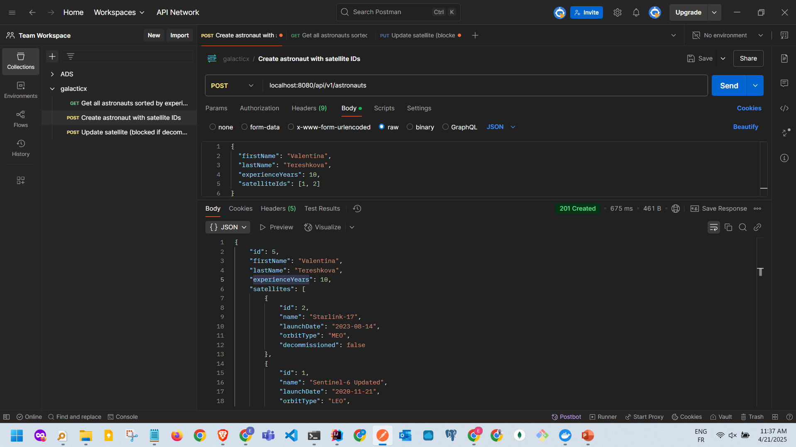
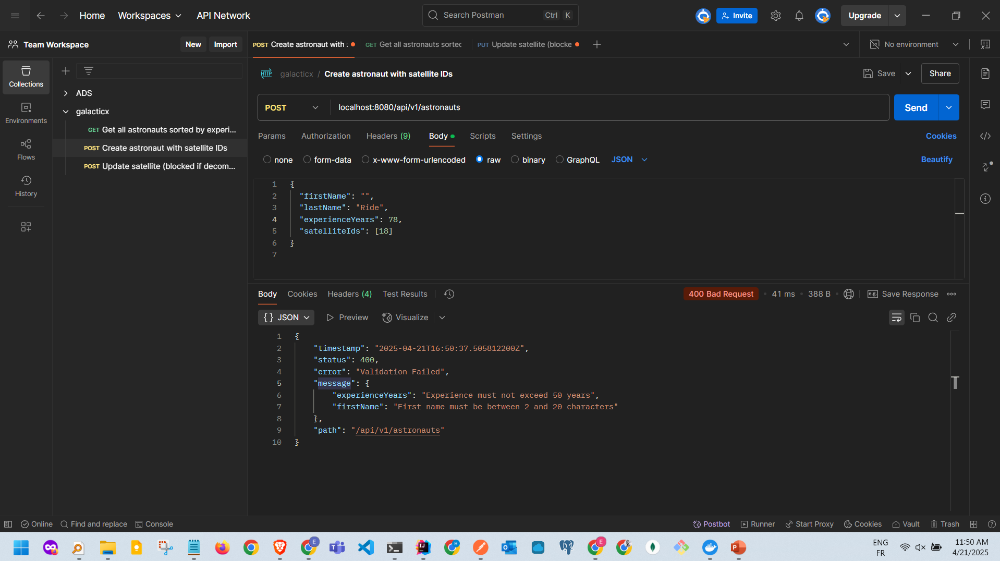
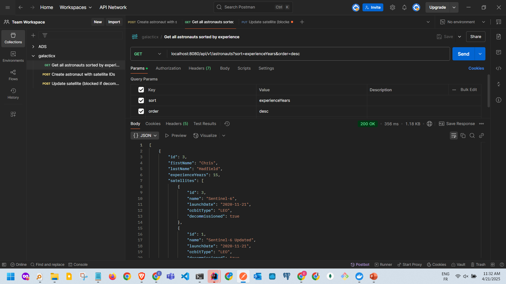
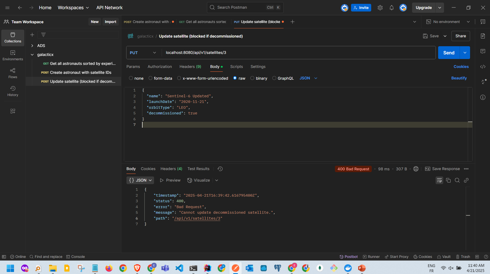
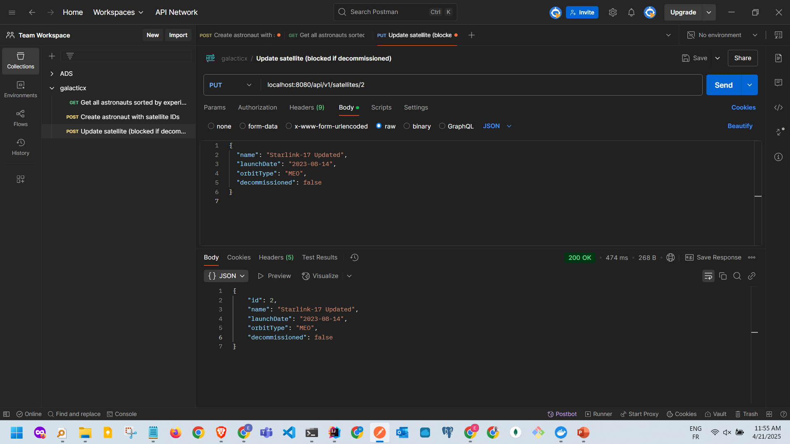

#  GalacticX Satellite-Astronaut Tracking System

A layered Spring Boot application to manage astronauts, satellites, and their assignments — built with best practices including DTOs, validation, exception handling, and structured architecture.

---

## Features

- Create astronauts with assigned satellites
- List astronauts with dynamic sorting
- Update satellites (only if not decommissioned)
- Field-level and business validation
- Structured global exception handling
- RESTful API responses with nested data
- PostgreSQL database
- Seed data auto-loaded on startup

---

## 📂 Project Structure

```
src/main/java/com/eli/galacticx/
├── controller/
├── service/
│   └── impl/
├── repository/
├── dto/
├── model/
├── exception/
├── config/
```

---

## ⚙️ Technologies Used

- Java 17+
- Spring Boot 3+
- Spring Data JPA
- Jakarta Validation
- PostgreSQL
- Lombok

---

## 📄 API Endpoints

### 🧑‍🚀 Astronauts

| Method | Endpoint                          | Description                                  |
|--------|-----------------------------------|----------------------------------------------|
| POST   | `/api/v1/astronauts`              | Add new astronaut with list of satellite IDs |
| GET    | `/api/v1/astronauts?sort=field&order=asc| desc  List all astronauts with dynamic sorting `                                      | |

### 🛰️ Satellites

| Method | Endpoint                | Description                                   |
|--------|-------------------------|-----------------------------------------------|
| PUT    | `/api/v1/satellites/{id}` | Update satellite (blocked if decommissioned) |

---

##  Validation Rules

- First & last names: 2–20 characters, not blank
- Experience: between 0 and 50 years
- Satellite name: not blank, must be unique
- Launch date: must be in the past
- Orbit type: one of `"LEO"`, `"MEO"`, `"GEO"`
- Satellite must exist when assigning to astronaut
- Cannot update decommissioned satellites

---

## ❌ Error Handling

All errors return structured JSON:

```json
{
  "timestamp": "2025-04-21T14:00:00",
  "status": 404,
  "error": "Not Found",
  "message": "Satellite with ID 99 not found",
  "path": "/api/v1/astronauts"
}
```

---

## 🧪 Seed Data

Preloaded on startup:

### Astronauts:
- Neil Armstrong
- Sally Ride
- Chris Hadfield

### Satellites:
- Hubble
- Starlink-17
- Sentinel-6 (decommissioned)

---

## 📸 Screenshots

### ✅ API Test – Create Astronaut
Create Astronaut with Valid Satellite IDs

POST /api/v1/astronauts




❌ Failed because of validation :


---

### ✅ API Test – Sort Astronauts
Get Astronauts Sorted by Experience (Descending)

GET /api/v1/astronauts?sort=experienceYears&order=desc



---

### ✅ API Test – Update Satellite

❌Block Update of Decommissioned Satellite
Endpoint:
PUT /api/v1/satellites/3



✅ Update of NON-decommissioned Satellite
Endpoint:
PUT /api/v1/satellites/2


---

## Author

**Eli Occansey**  
Built as a coding assessment for APSD.

---

## 📦 Setup

```bash
# Create DB if needed
psql -U postgres
CREATE DATABASE galacticx;

# Run the app
./mvnw spring-boot:run
```

Make sure PostgreSQL is running and `application.properties` is configured.

---

## 📫 Contact

For questions or suggestions, feel free to reach out!